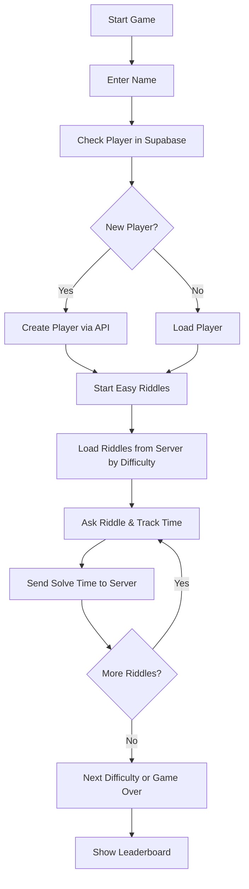

# 🧠 Riddle Game (Full Stack Edition)

An interactive terminal-based riddle game built with Node.js, using **ES Modules**, **Object-Oriented Programming**, and a full **Express.js backend** with **Supabase** and **MongoDB**.

---

## 🎯 Project Goal

Build a full-stack riddle game where:
- Players solve riddles in increasing difficulty
- Player data and riddle statistics are stored in databases
- Admins can manage riddles (CRUD)
- Leaderboards are dynamically generated by server logic

---

## 🧱 Architecture Overview

```
client/                   // Terminal-based game UI (readline-sync)
│
├── app.js               // Entry point (menu + actions)
├── Riddle.js            // Riddle class logic
├── Player.js            // Player logic & methods
└── gameLogic.js         // All game/admin logic, modular in one file

server/                  // Express.js REST API
│
├── app.js               // Server setup and route mounting
├── routes/              // Routers for /players and /riddles
├── controllers/         // Request logic handlers
├── dal/                 // Data access layers (Supabase & MongoDB)
├── utils/               // Logger middleware
└── lib/                 // DB clients: mongoClient.js, supabaseClient.js
```

---

## 🛠️ Technologies Used

**Frontend (Terminal client):**
- Node.js
- readline-sync
- ES Modules
- OOP principles

**Backend (API server):**
- Express.js
- Supabase (for players)
- MongoDB Atlas (for riddles)
- RESTful routing

---

## 🔹 Game Flow (Client)



---

## 👤 Main Classes

### `Riddle`

Represents a riddle object from the server.

- `id`, `taskDescription`, `difficulty`, `correctAnswer`, etc.
- `ask()` – Interactively asks the user to solve it

### `Player`

Manages interaction with the server via API:

- `fromSupabaseRecord()` – Initializes from server data
- `solveRiddle()` – Sends solved riddle and time to backend

---

## ⚙️ REST API Endpoints

### 🔍 Riddles

- `GET /riddles` – Get all riddles  
- `GET /riddles/difficulty/:level` – Get riddles by difficulty  
- `POST /riddles` – Create a riddle  
- `PUT /riddles/:id` – Update a riddle  
- `DELETE /riddles/:id` – Delete a riddle  

### 🧑 Players

- `GET /players` – Get all players  
- `GET /players/sorted-by-total` – Leaderboard  
- `POST /players` – Register new player  
- `PUT /players/:id` – Update stats

---

## 📦 How to Run

### Client (Terminal Game)

```bash
npm install readline-sync
node app.js
```

### Server (API)

```bash
cd server/
npm install
node app.js
```

Ensure your environment has:
- `SUPABASE_URL` + `SUPABASE_KEY`
- `MONGODB_URI`

---

## 🧪 Features

- Interactive terminal-based gameplay
- Server-driven riddles by difficulty
- MongoDB riddle storage with CRUD
- Supabase player storage with tracking
- Leaderboard via backend route

---

✍️ Written by Nahman Ben Or  
🧑‍🏫 Full Stack Track – Yishai Malkieli
