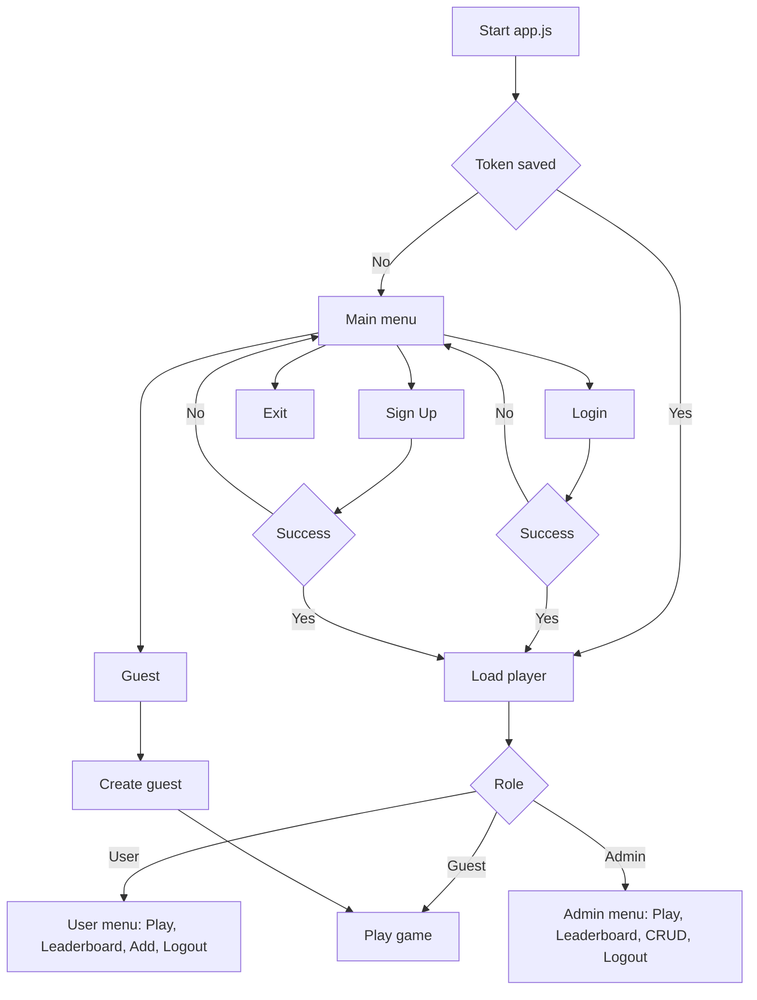

# 🧠 Riddle Game (Terminal Edition)

A full-stack interactive riddle game built with **Node.js**, using **Object-Oriented Programming**, ES Modules, and a **RESTful Express.js** backend powered by **Supabase** and **MongoDB**.

---

## 🎯 Project Overview

- Terminal-based riddle game using `readline-sync`
- Players solve riddles from easy to hard
- Guest mode for instant access without registration
- Authenticated players tracked via Supabase
- Admins can fully manage riddles (CRUD)
- Leaderboard based on total riddles solved
- Token-based authentication (JWT) with auto-login
- Game data stored via Supabase (riddles) and MongoDB (player stats)

---

## 🗂️ Project Structure

```
.
├── app.js                  # Entry point for the terminal game
├── core/                  # Core game logic
│   ├── GameEngine.js      # Main game loop and gameplay logic
│   └── Player.js          # Player class, roles, and token handling
├── riddles/               # Riddle-related logic
│   ├── Riddle.js          # Riddle object creation and printing
│   └── RiddleController.js# Client-side CRUD operations for riddles
├── managers/              # Game flow and menu managers
│   ├── GameManager.js     # Main login/signup/guest/start menu
│   ├── GameStarter.js     # Starts the GameEngine
│   ├── GuestManager.js    # Guest player logic
│   ├── AuthManager.js     # Login/signup process
│   └── MenuManager.js     # Menus for user/admin actions
├── utils/                 # Shared utilities
│   ├── idHelper.js        # Generates auto-incrementing riddle IDs
│   └── TokenManager.js    # Save/load/delete local JWT token
├── lib/
│   └── riddleId.txt       # Tracks last used riddle ID
└── README.md              # This file
```

---

## ⚙️ Installation & Running

### 1. Install dependencies:
```bash
npm install
```

### 2. Run the terminal game:
```bash
node app.js
```

### 3. Run the backend server:
Assuming it's in a separate folder (`/server`):
```bash
cd server/
npm install
node app.js
```

✅ Make sure to set up `.env` on the server:
```env
SUPABASE_URL=...
SUPABASE_KEY=...
MONGODB_URI=...
JWT_SECRET=...
```

---

## 👥 Player Roles

| Role   | Description |
|--------|-------------|
| Guest  | No registration needed, plays immediately |
| User   | Registered player, can play, create riddles, view leaderboard |
| Admin  | Full permissions: CRUD riddles, view leaderboard, play |

---

## 🔁 Game Flow (Medium Detail)



---

## 🔧 API Overview

### 🔐 Player Endpoints
| Method | Endpoint                | Description               |
|--------|-------------------------|---------------------------|
| POST   | `/players`              | Signup                    |
| POST   | `/players/login`        | Login                     |
| POST   | `/players/guest`        | Create guest account      |
| POST   | `/players/solve`        | Submit solved riddle data |
| GET    | `/players/sorted-by-total` | Get leaderboard         |

### 🧩 Riddle Endpoints
| Method | Endpoint                  | Description         |
|--------|---------------------------|---------------------|
| GET    | `/riddles`                | Get all riddles     |
| GET    | `/riddles/difficulty/:d`  | Filter by difficulty|
| POST   | `/riddles`                | Create riddle       |
| PUT    | `/riddles/:id`            | Update riddle       |
| DELETE | `/riddles/:id`            | Delete riddle       |

---

## 🧪 Features

- Terminal-based UI with `readline-sync`
- Local JWT storage and auto-login
- Riddle difficulty flow: easy → hard
- Solving time tracked per riddle
- Leaderboard with total solved
- Admins can manage riddles via terminal
- Role-based access control for actions

---

## ✍️ Author

Developed by **Nahman Ben Or**  
Guided by **Yishai Malkieli** – Full Stack Training Program

---
