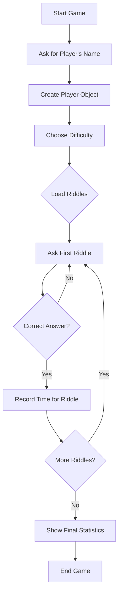

# Riddle Game 

An interactive terminal-based riddle game written in JavaScript using ES Modules and Object-Oriented Programming.

---

## 🎯 Project Goal

Build a terminal game where the player solves a series of riddles. The system tracks how long it takes to answer all riddles and displays detailed statistics at the end.

---

## 📁 Project Structure

```
riddle-game/
├── app.js               // Main file that starts the game
├── riddles/             // Folder containing all riddles
│   ├── allRiddles.js    // Central import of all riddles
│   └── ...              // Individual riddle files
└── classes/             // Game classes
    ├── Riddle.js
    ├── Player.js
    ├── Game.js
```

---

## 🛠️ Technologies Used

* Node.js (Terminal environment)
* ES Modules (import/export)
* readline-sync (Synchronous terminal input)
* Object-Oriented Programming (OOP)

---

## 🔹 Game Flow



**Note:** After the player enters their name, a `Player` object is immediately created to store the player's name and track their riddle completion times.

---

## 👤 Main Classes

### `Riddle`

* Represents a single riddle
* **Properties:** `id`, `subject`, `difficulty`, `taskDescription`, `correctAnswer`
* **Methods:** `ask()` - Displays the riddle and waits for the correct answer

### `Player`

* Tracks player information and riddle completion times
* **Properties:** `name`, `times` (object with times per riddle)
* **Methods:** `recordTime()`, `getTotalTime()`, `getRiddleCount()`, `showStats()`

### `Game`

* Manages the game flow
* Handles player creation, riddle loading, time tracking, and displaying stats

---

## 📦 Installation & Run

1. Install dependencies:

   ```bash
   npm install readline-sync
   ```

2. Run the game:

   ```bash
   node app.js
   ```

---

📝 Credits

Written by Nahman Ben Or as part of the Full Stack track taught by Yishai Malkieli.

---
